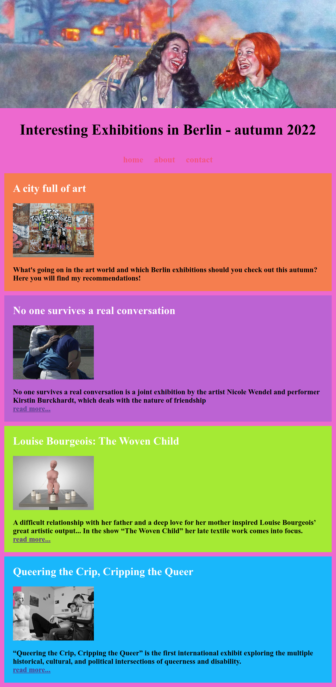
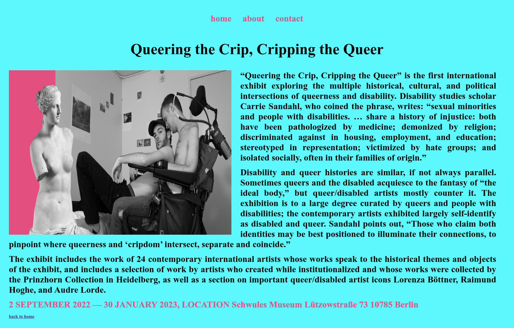
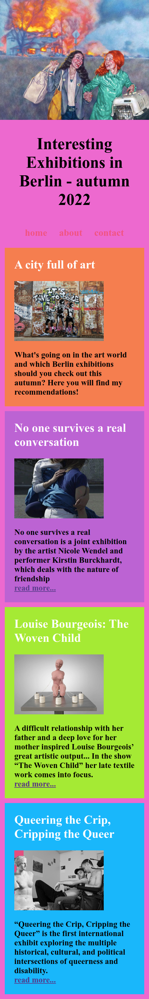
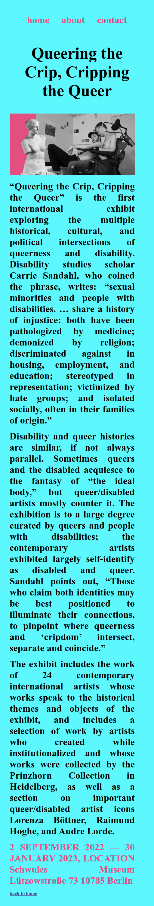

# Berlins Exhibitions Blog

## Exercise Course-Module 1 - UserInterfaceBasics (UIB) - HTML/CSS

created at 01.09.2022;

Created an index.html page and a posts directory containing the blog posts.
Inside the posts directory created a HTML file for each post.
In the `index.html` listed all the posts available, showing the main picture, title, and the first few lines of content and at the end a `read more` link that points to the full blog post.
Inside each individual post page are the main image, the title, the full content and some extra images. I used some floating image in the text, different background color and colored links.

### My desktop version:

#### main-page:

#### sub-pages:

### My mobile version:

#### main-page:

#### sub-pages:

